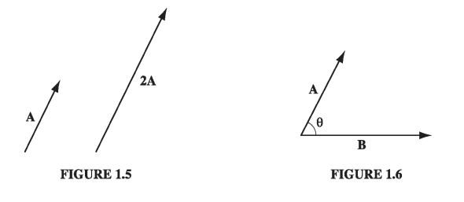
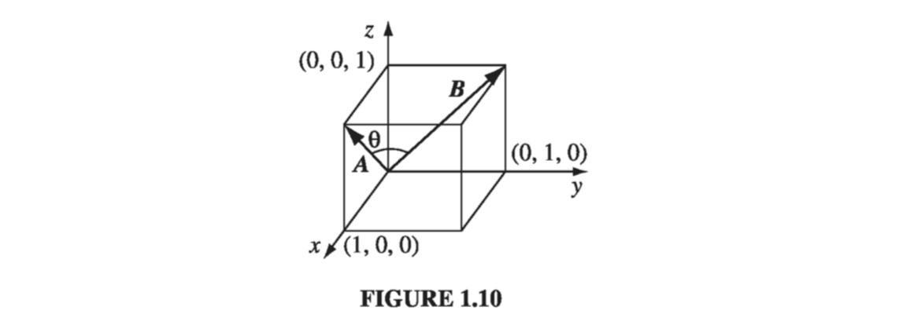
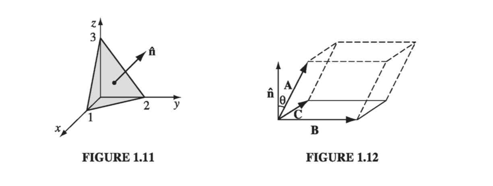
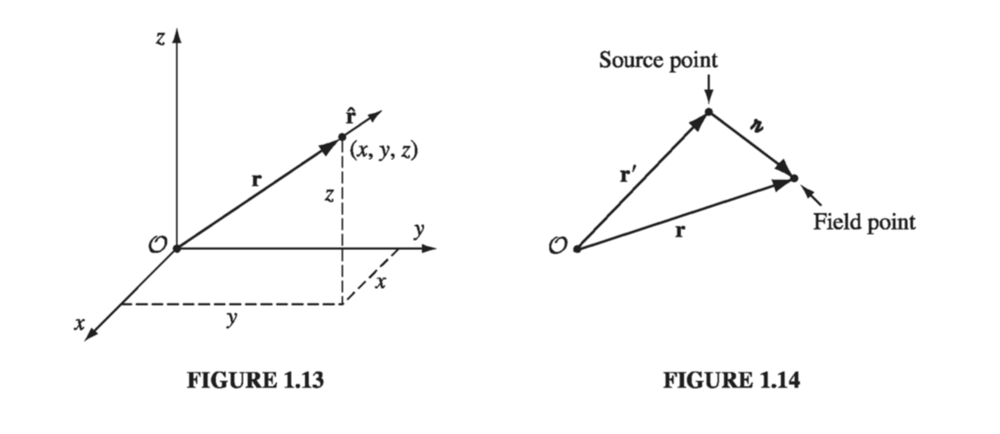
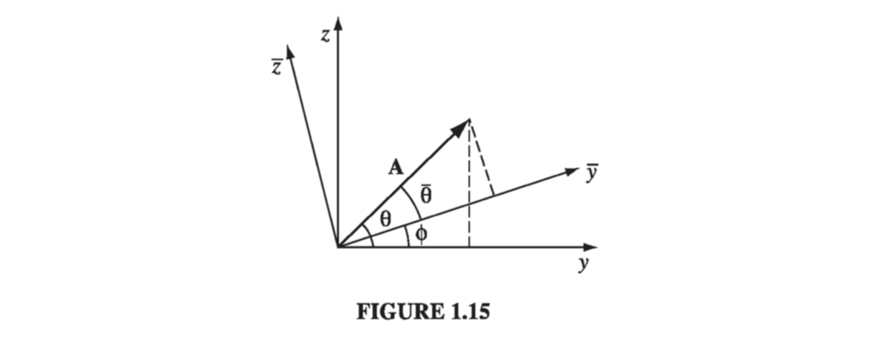

# 1.1 Vector Algebra

## 1.1.1 Vector Operations

If you walk 4 miles due north and then 3 miles due east (Fig. 1.1), you will have gone a total of 7 miles, but you're _not_ 7 miles from where you set out-you're only 5. We need an arithmetic to describe quantities like this, which evidently do not add in the ordinary way. The reason they don't, of course, is that __displacements__ (straight line segments going from one point to another) have _direction_ as well as _magnitude_ (length), and it is essential to take both into account when you combine them. Such objects are called vectors: velocity, acceleration, force and momentum are other examples. By contrast, quantities that have magnitude but no direction are called scalars: examples include mass, charge, density, and temperature.

I shall use boldface ($ \vec{A} $ , $ \vec{B} $ , and so on) for vectors and ordinary type for scalars. The magnitude of a vector $ \vec{A} $  is written $ |\vec{A}| $  or, more simply, $ A $ . In diagrams, vectors are denoted by arrows: the length of the arrow is proportional to the magnitude of the vector, and the arrowhead indicates its direction. Minus $ \vec{A} $  ($ - \vec{A} $ ) is a vector with the same magnitude as $A$ but of opposite direction (Fig. 1.2). Note that vectors have magnitude and direction but not location: a displacement of 4 miles due north from Washington is represented by the same vector as a displacement 4 miles north from Baltimore (neglecting, of course, the curvature of the earth). On a diagram, therefore, you can slide the arrow around at will, as long as you don't change its length or direction.

:::{figure-md} Figure-1.1

Figures 1.1 and 1.2
:::

We define four vector operations: addition and three kinds of multiplication.

__(i) Addition of two vectors.__. Place the tail of $ \vec{B} $ at the head of $ \vec{A} $; the sum, $ \vec{A} + \vec{B} $, is the vector from the tail of $ \vec{A} $ to the head of $ \vec{B} $ [Fig 1.3](Figure-1.3). This rule generalizes the obvious procedure for combining two displacements. Addition is _commutative_:

$$
\vec{A} + \vec{B} = \vec{B} + \vec{A}
$$

3 miles east followed by 4 miles north gets you to the same place as 4 miles north followed by 3 miles east. Addition is also associative:

$$
(\vec{A} + \vec{B}) + \vec{C} = \vec{A} + (\vec{B} + \vec{C})
$$

To subtract a vector, add its opposite [Fig. 1.4](Figure-1.3):

$$
\vec{A} - \vec{B} = \vec{A} + (- \vec{B})
$$

:::{figure-md} Figure-1.3

Figures 1.3 and 1.4
:::

__(ii) Multiplication by a scalar.__ Multiplication of a vector by a positive scalar a multiplies the magnitude but leaves the direction unchanged (Fig. 1.5). (If a is negative, the direction is reversed.) Scalar multiplication is distributive:

$$
a(\vec{A} + \vec{B}) = a \vec{A} + a \vec{B}
$$

__(iii) Dot product of two vectors.__ The dot product of two vectors is defined by

$$
\vec{A} \cdot \vec{B} = A B \cos \theta 
$$ (eq1.1)

where $ \theta $  is the angle they form when placed tail-to-tail (Fig. 1.6). Note that $ \vec{A} \cdot \vec{B} $ is itself a scalar (hence the alternative name _scalar product_). The dot product is commutative,

$$
\vec{A} \cdot \vec{B} = \vec{B} \cdot \vec{A}
$$

and distributive

$$
\vec{A} \cdot (\vec{B} + \vec{C}) = \vec{A} \cdot \vec{B} + \vec{A} \cdot \vec{C} 
$$ (eq1.2)

Geometrically, $ \vec{A} \cdot \vec{B} $ is the product of A times the projection of B along A (or the product of B times the projection of A along B). If the two vectors are parallel, then $ \vec{A} \cdot \vec{B} = AB $. In particular, for any vector A

$$
\vec{A} \cdot \vec{A} = A^2 
$$ (eq1.3)
 
If A and B are perpendicular, then $ \vec{A} \cdot \vec{B} = 0 $

---

### Example 1.1

::::{tab-set}
:::{tab-item} Q

Let $ \vec{C} = \vec{A} - \vec{B} $ (Fig 1.7), and calculate the dot product of $ \vec{C} $ with itself.

:::
:::{tab-item} A

$$
\vec{C} \cdot \vec{C} = ( \vec{A} - \vec{B} ) \cdot (\vec{A} - \vec{B}) = \vec{A} \cdot \vec{A} - \vec{A} \cdot \vec{B} - \vec{B} \cdot \vec{A} + \vec{B} \cdot \vec{B}
$$

or

$$
C^2 = A^2 + B^2 - 2AB\cos \theta
$$

This is the law of cosines.

:::
::::

__(iv) Cross product of two vectors.__ The cross product of two vectors is defined by

$$
\vec{A} \times \vec{B} = AB \sin \theta \hat{n} 
$$ (eq1.4)

where $ \hat{n} $ is a unit vector (vector of magnitude 1) pointing perpendicular to the plane of A and B. (I shall use a hat $ \hat{} $ to denote unit vectors.) Of course, there are two directions perpendicular to any plane: "in" and "out." The ambiguity is resolved by the right-hand rule: let your fingers point in the direction of the first vector and curl around (via the smaller angle) toward the second; then your thumb indicates the direction of $ \hat{n} $. (In Fig. 1.8, $ \vec{A} \times \vec{B} $ points into the page; $ \vec{B} \times \vec{A} $  points out of the page.) Note that $ \vec{A} \times \vec{B} $  is itself a vector (hence the alternative name
vector product). The cross product is distributive

$$
\vec{A} \times ( \vec{B} + \vec{C}) = ( \vec{A} \times \vec{B}) + (\vec{A} \times \vec{C})
$$

but not _commutative_. In fact,

$$
(\vec{B} \times \vec{A}) = - (\vec{A} \times \vec{B}) 
$$ (eq1.6)

Geometrically, $ | \vec{A} \times \vec{B} | $ is the area of the parallelogram generated by $ \vec{A} $ and $ \vec{B} $ (Fig 1.8). If two vectors are parallel, their cross product is zero. In particular,

$$
 \vec{A} \times \vec{A} = 0
 $$
 
for any vector A.

## 1.1.2: Vector Algebra: Component Form

In the previous section, I defined the four vector operations (addition, scalar multiplication, dot product, and cross product) in "abstract" form-that is, without reference to any particular coordinate system. In practice, it is often easier to set up Cartesian coordinates x, y, z and work with vector components. Let $ \hat{x} $, $ \hat{y} $ , and $ \hat{z} $ be unit vectors parallel to the x, y, and z axes, respectively (Fig. 1.9(a)). An arbitrary vector A can be expanded in terms ofthese basis vectors (Fig. 1.9(b)):

$$
\vec{A} = A_x \hat{x} + A_y \hat{y} + A_z \hat{z}
$$

The numbers $ A_x $, $ A_y $, and $ A_z $ are the "components" of A; geometrically, they are the projections of A along the three coordinate axes ($ A_x = \vec{A} \cdot \hat{x}, A_y = \vec{A} \cdot \hat{y}, A_z = \vec{A} \cdot \hat{z} $ ). We can now reformulate each of the four vector operations as a rule for manipulating components:

$$
\vec{A} + \vec{B} = (A_x \hat{x} + A_y \hat{y} + A_z \hat{z}) + (B_x \hat{x} + B_y \hat{y} + B_z \hat{z}) \\
 = (A_x + B_x) \hat{x} + (A_y + B_y) \hat{y} + (A_z + B_z) \hat{z} 
$$ (eq1.7)

__Rule (i):__ To add vectors, add like components.

$$
a\vec{A} = (a A_x) \hat{x} + (a A_y) \hat{y} + (a A_z)\hat{z} 
$$ (eq1.8)

__Rule (ii):__ To multiply by a scalar, multiply each component.

Because $ \hat{x}, \hat{y} $, and $ \hat{z} $ are mutually perpendicular unit vectors

$$
\hat{x} \cdot \hat{x} = \hat{y} \cdot \hat{y} = \hat{z} \cdot \hat{z} = 1; \qquad \hat{x} \cdot \hat{y} = \hat{x} \cdot \hat{z} = \hat{y} \cdot \hat{z} = 0 
$$ (eq1.9)

Accordingly,

$$
\vec{A} \cdot \vec{B} = (A_x \hat{x} + A_y \hat{y} + A_z \hat{z}) \cdot (B_x \hat{x} + B_y \hat{y} + B_z \hat{z}) \\
 = A_x B_x + A_y B_y + A_z B_z 
$$ (eq1.10)

__Rule (iii):__ To calculate the dot product, multiply like components and add. In particular,

$$
\vec{A} \cdot \vec{A} = A_x ^2 + A_y ^2 + A_z ^2
$$

so

$$
A = \sqrt{A_x ^2 + A_y ^2 + A_z ^2} 
$$ (eq1.11)

Similarly,

$$
\begin{aligned}
\hat{x} \times \hat{x} & = & \hat{y} \times \hat{y} & = & \hat{z} \times \hat{z} = 0 \\
\hat{x} \times \hat{y} & = & - \hat{y} \times \hat{x} & = & \hat{z} \\
\hat{y} \times \hat{z} & = & - \hat{z} \times \hat{y} & = & \hat{x} \\
\hat{z} \times \hat{x} & = & - \hat{x} \times \hat{z} & = & \hat{y}
\end{aligned}
$$

Therefore,

$$
\vec{A} \times \vec{B} = (A_x \hat{x} + A_y \hat{y} + A_z \hat{z}) \times (B_x \hat{x} + B_y \hat{y} + B_z \hat{z}) \\
 = (A_y B_z - A_z B_y) \hat{x} + (A_z B_x - A_x B_z)\hat{y} + (A_x B_y - A_y B_x) \hat{z} 
$$ (eq1.13)

This cumbersome expression can be written more neatly as a determinant:

$$
\vec{A} \times \vec{B} = \begin{vmatrix}
\hat{x} & \hat{y} & \hat{z} \\
A_x & A_y & A_z \\
B_x & B_y & B_z
\end{vmatrix}
$$

__Rule (iv):__ To calculate the cross product, form the determinant whose first row is $ \hat{x}, \hat{y}, \hat{z} $, whose second row is A, and whose third row is B.

### Example 1.2

::::{tab-set}
:::{tab-item} Q

Find the angle between the face diagonals of a cube.

:::
:::{tab-item} A

__Solution__
We might as well use a cube of side 1, and place it as shown in Fig 1.10, with one corner at the origin. The face diagonals $ \vec{A} $ and $ \vec{B} $ are

$$
\vec{A} = 1 \hat{x} + 0 \hat{y} + 1 \hat{z}; \qquad \vec{B} = 0 \hat{x} + 1 \hat{y} + 1 \hat{z}
$$

So, in component form,

$$
\vec{A} \cdot \vec{B} = 1 \cdot 0 + 0 \cdot 1 + 1 \cdot 1 = 1
$$

On the other hand, in "abstract" form,

$$
\vec{A} \cdot \vec{B} = AB \cos \theta = \sqrt{2} \sqrt{2} \cos \theta = 2 \cos \theta
$$

Therefore,

$$
\cos \theta = 1/2 \quad \text{ or } \quad \theta = 60^{\circ}
$$

Of course, you can get the answer more easily by drawing in a diagonal across the top of the cube, completing the equilateral triangle. But in cases where the geometry is not so simple, this device of comparing the abstract and component forms of the dot product can be a very efficient means of finding angles.

:::
::::

## 1.1.3: Triple Products

Since the cross product of two vectors is itself a vector, it can be dotted or crossed with a third vector to form a triple product.

__(i) Scalar triple product:__ $ \vec{A} \cdot (\vec{B} \times \vec{C}) $. Geometrically, $ |\vec{A} \cdot (\vec{B} \times \vec{C}) | $ is the volume of the parallelpiped generated by __A__, __B__, and __C__, since $ |\vec{B} \times \vec{C}| $ is the area of the base, and $ | \vec{A} \cos \theta | $ is the altitude (Fig. 1.12). Evidently,

$$
\vec{A} \cdot(\vec{B} \times \vec{C}) = \vec{B} \cdot (\vec{C} \times \vec{A}) = \vec{C} \cdot (\vec{A} \times \vec{B}) 
$$ (eq1.15)

for they all correspond to the same figure. Note that "alphabetical" order is preserved - in view of {eq}`eq1.6`, the "nonalphabetical" triple products

$$
\vec{A} \cdot(\vec{C} \times \vec{B}) = \vec{B} \cdot (\vec{A} \times \vec{C}) = \vec{C} \cdot (\vec{B} \times \vec{A}) 
$$

have the opposite sign. In component form,

$$
\vec{A} \cdot (\vec{B} \times \vec{C}) = \begin{vmatrix}
A_x & A_y & A_z \\
B_x & B_y & B_z \\
C_x & C_y & C_z
\end{vmatrix} 
$$ (eq1.16)

Note that the dot and cross can be interchanged:

$$
\vec{A} \cdot (\vec{B} \times \vec{C}) = (\vec{A} \times \vec{B}) \cdot \vec{C}
$$

(this follows immediately from Eq. 1.15); however, the placement of the parentheses is critical: $ (\vec{A} \cdot \vec{B}) \cdot \vec{C} $ is a meaningless expression - you can't make a cross product from a scalar and a vector.

__(ii) Vector triple product:__ $ \vec{A} \times (\vec{B} \times \vec{C}) $. The vector triple product can be simplified by the so-called __BAC-CAB__ rule:

$$
\vec{A} \times (\vec{B} \times \vec{C}) = \vec{B}(\vec{A} \cdot \vec{C}) - \vec{C} (\vec{A} \cdot \vec{B}) 
$$ (eq1.17)

Notice that

$$
(\vec{A} \times \vec{B}) \times \vec{C} = - \vec{C} \times (\vec{A} \times \vec{B}) = -\vec{A}(\vec{B} \cdot \vec{C}) + \vec{B}(\vec{A} \cdot \vec{C})
$$

is an entirely different vector (cross-products are not associative). All higher vector products can be similarly reduced, often by repeated application of {eq}`eq1.17`, so it is never necessary for an expression to contain more than one cross product in any term. For instance,

$$
(\vec{A} \times \vec{B}) \cdot (\vec{C} \times \vec{D}) = (\vec{A} \cdot \vec{C})(\vec{B} \cdot \vec{D}) - (\vec{A} \cdot \vec{D}) (\vec{B} \cdot \vec{C})
$$

$$
\vec{A} \times [\vec{B} \times (\vec{C} \times \vec{D})] = \vec{B}[ \vec{A} \cdot (\vec{C} \times \vec{D})] - (\vec{A} \cdot \vec{B})(\vec{C} \times \vec{D}) 
$$ (eq1.18)

## 1.1.4: Position, Displacement, and Separation Vectors

The location of a point in three dimensions can be described by listing its Cartesian coordinates (x, y, z). The vector to that point from the origin ($ \mathscr{O} $) is called the _position vector_ (Fig 1.13):

$$
\vec{r} \equiv x \hat{x} + y \hat{y} + z \hat{z} 
$$ (eq1.19)

I will reserve the letter $ \vec{r} $ for this purpose. Its magnitude,

$$
r = \sqrt{x^2 + y^2 + z^2} 
$$ (eq1.20)

is the distance from the origin, and

$$
\hat{r} = \frac{\vec{r}}{r}  = \frac{x \hat{x} + y \hat{y} + z \hat{z}}{ \sqrt{x^2 + y^2 + z^2}} 
$$ (eq1.21)

is a unit vector pointing radially outward. The infinitesimal displacement vector from $ (x, y, z) $ to $ x + \mathrm{d}{x}, y + \mathrm{d}{y}, z + \mathrm{d}{z} $ is

$$
\mathrm{d}{\vec{l}} = \mathrm{d}{x} \hat{x} + \mathrm{d}{y} \hat{y} + \mathrm{d}{z} \hat{z} 
$$ (eq1.22)

(We could call this $ \mathrm{d}{\vec{r}} $, since that's what it is, but it is useful to have a special notation for infinitesimal displacements.)

In electrodynamics, one frequently encounters problems involving _two_ points - typically a __source point__, $ \vec{r'} $, where an electric charge is located, and a __field point__ $ \vec{r} $ at which you are calculating the electric or magnetic field (Fig 1.14). It pays to adopt right from the start some short-hand notation for the __separation vector__ from the source point to the field point. I shall use for this purpose the letter $ \Delta r  $:

$$
\vec{\Delta r } \equiv \vec{r} - \vec{r'} 
$$ (eq1.23)

Its magnitude is

$$
|\Delta r | = | \hat{r} - \hat{r'} | 
$$ (eq1.24)

and a unit vector in the direction from $ \vec{r'}  $ to $ \vec{r} $ is

$$
\hat{\Delta r } = \frac{\Delta r }{|\Delta r |} = \frac{\vec{r} - \vec{r'}}{|\vec{r} - \vec{r'}|} \tag{1.25}  
$$

In Cartesian coordinates,

$$
\Delta r  = (x - x') \hat{x} + (y-y') \hat{y} + (z-z') \hat{z} 
$$ (eq1.26)

$$
|\Delta r | = \sqrt{(x - x')^2 + (y-y')^2 + (z-z')^2  } 
$$ (eq1.27)

$$
\hat{\Delta r } = \frac{(x - x') \hat{x} + (y-y') \hat{y} + (z-z') \hat{z}}{\sqrt{(x - x')^2 + (y-y')^2 + (z-z')^2  }} 
$$

(from which you can appreciate the economy of the $ \Delta r  $ notation).

## 1.1.5: How Vectors Transform

The definition of a vector as "a quantity with a magnitude and direction" is not altogether satisfactory: What precisely does "direction" mean? This may seem a pedantic question, but we shall soon encounter a species of derivative that looks rather like a vector, and we'll want to know for sure whether it is one.

You might be inclined to say that a vector is anything that has three components that combine properly under addition. Well, how about this: We have a barrel of fruit that contains $ N_x $  pears, $ N_y $  apples, and $ N_z $  bananas. Is $ \vec{N} = N_x \hat{x} + N_y \hat{y} + N_z \hat{z} $  a vector? It has three components, and when you add another barrel with $ M_x $  pears, $ M_y $  apples, and $ M_z $  bananas the result is $ N_x + M_x $ pears, $ N_y + M_y $ apples, $ N_z + M_z $ bananas. So it does add like a vector. Yet it's obviously not a vector, in the physicist's sense of the word, because it doesn't really have a direction. What exactly is wrong with it?

The answer is that $ \vec{N} $ _does not transform properly when you change coordinates_. The coordinate frame we use to describe positions in space is of course entirely arbitrary, but there is a specific geometrical transformation law for converting vector components from one frame to another. Suppose, for instance, the $ \overline{x}, \overline{y}, \overline{z} $ system is rotated by angle $ \phi $, relative to $ x, y, z $, about the common $ x = \overline{x} $ axes. From Fig. 1.15,

$$
A_y = A \cos \theta, \qquad A_z = A \sin \theta
$$

while

$$
\begin{aligned}
\overline{A_y} & = A \cos \overline{\theta} = A \cos (\theta - \phi) = A (\cos \theta \cos \phi + \sin \theta \sin \phi) \\
& = \cos \phi A_y + \sin \phi A_z \\
\overline{A_z} & = A \sin \overline{\theta} = A \sin (\theta - \phi) = A (\sin \theta \cos \phi - \cos \theta \sin \phi) \\
& = - \sin \phi A_y + \cos \phi A_z
\end{aligned}
$$

We might express this conclusion in matrix notation:

$$
\begin{pmatrix}
 \overline{A_y} \\
 \overline{A_z}
\end{pmatrix} = 
\begin{pmatrix}
 \cos \phi & \sin \phi \\
 - \sin \phi & \cos \phi
\end{pmatrix}
\begin{pmatrix}
A_y \\
A_z
\end{pmatrix} 
$$ (eq1.29)

More generally, for rotation about an _arbitrary_ axis in three dimensions, the transformation law takes the form

$$
\begin{pmatrix}
 \overline{A_x} \\
 \overline{A_y} \\
 \overline{A_z}
\end{pmatrix} = 
\begin{pmatrix}
 R_{xx} & R_{xy} & R_{xz} \\
 R_{yx} & R_{yy} & R_{yz} \\
 R_{zx} & R_{zy} & R_{zz}
\end{pmatrix}
\begin{pmatrix}
A_x \\
A_y \\
A_z
\end{pmatrix} 
$$ (eq1.30)

or, more compactly,

$$
\overline{A_i} = \sum_{j=1}^3 R_{ij} A_j 
$$ (eq1.31)

where index 1 stands for x, 2 for y, and 3 for z. The elements of the matrix R can be ascertained, for a given rotation, by the same sort of trigonometric arguments as we used for a rotation about the x axis.
Now: Do the components of $ \vec{N} $ transform this way? Of course not - it doesn't matter what coordinates you use to represent positions in space; there are still just as many apples in the barrel. You can't convert a pear into a banana by choosing a different set of axes, but you can turn in $ A_x $ into $ \overline{A_y} $. Formally, then, _a vector is any set of three components that transforms in the same manner as a displacement when you change coordinates_. As always, displacement is the _model_ for the behavior of vectors.

By the way, a (second-rank) __tensor__ is a quantity with nine components, $ T_{xx}, T_{xy}, T_{xz}, T_{yx}, \ldots T_{zz} $  which transform with two factors of $ R $:

$$
\begin{aligned}
\overline{T}_{xx} & = R_{xx}(R_{xx} T_{xx} + R_{xy} T_{xy} + R_{xz} T_{xz}) \\
 & + R_{xy}(R_{xx} T_{yx} + R_{xy} T_{yy} + R_{xz} T_{yz}) \\
 & + R_{xz}(R_{xx} T_{zx} + R_{xy} T_{zy} + R_{xz} T_{zz}), \ldots
\end{aligned}
$$

or, more compactly,

$$
\overline{T}_{ij} = \sum_{k=1}^3 \sum_{l=1} ^3 R_{ik} R_{jl} T_{kl} 
$$ (eq1.32)

In general, an n-th rank tensor has $ n $ indices and $ 3^n $ components, and transforms with $ n $ factors of $ R $. In this hierarchy, a vector is a tensor of rank 1, and a scalar is a tensor of rank zero.
