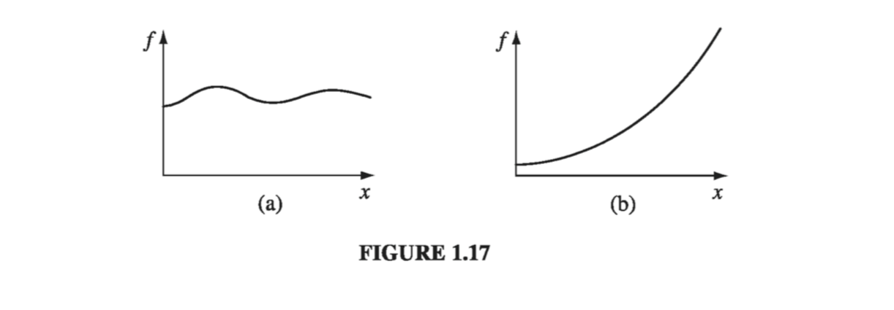
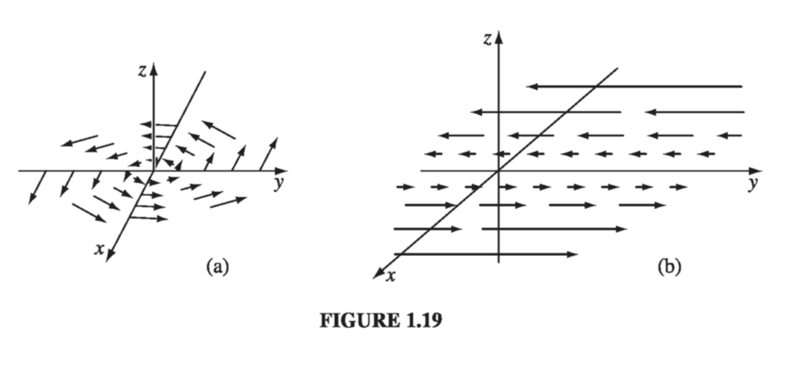

# 1.2: Differential Calculus

## 1.2.1: "Ordinary" Derivatives

Suppose we have a function of one variable, $ f(x) $. _Question_: what does the derivative $ \frac{\mathrm{d} f}{\mathrm{d} x} $ do for us? _Answer_: It tells us how rapidly the function $ f(x) $ varies when we change the argument x by a tiny amount, $ \mathrm{d}{x} $ 

$$
\mathrm{d}{f} = \left( \frac{\mathrm{d} f}{\mathrm{d} x} \right) \mathrm{d}{x} \tag{1.33}
$$

In words: If we increment _x_ by an infinitesimal amount $ \mathrm{d}{x} $, then $ f $ changes by an amount $ \mathrm{d}{f} $; the derivative is the proportionality factor. Foe example, in Fig. 1.17(a), the function varies slowly with _x_, and the derivative is correspondingly small. In Fig 1.17(b), _f_ increases rapidly with _x_, and the derivative is large as you move away from $ x = 0 $.
_Geometrical interpretation_: The derivative $ \frac{\mathrm{d} f}{\mathrm{d} x} $ is the slope of the graph of _f_ versus _x_.

## 1.2.2: Gradient
Suppose, now, that we have a function of three variables-say, the temperature T (x, y, z) in this room. (Start out in one comer, and set up a system of axes; then for each point (x, y, z) in the room, T gives the temperature at that spot.) We want to generalize the notion of "derivative" to functions like T, which depend not on one but on three variables.

A derivative is supposed to tell us how fast the function varies, if we move a little distance. But this time the situation is more complicated, because it depends on what direction we move: If we go straight up, then the temperature will prob- ably increase fairly rapidly, but if we move horizontally, it may not change much at all. In fact, the question "How fast does T vary?" has an infinite number of answers, one for each direction we might choose to explore.

Fortunately, the problem is not as bad as it looks. A theorem on partial derivatives states that

$$
\mathrm{d}{T} = \left( \frac{\partial T}{\partial x} \right)\mathrm{d}{x} + \left( \frac{\partial T}{\partial y} \right) \mathrm{d}{y} + \left( \frac{\partial T}{\partial z} \right) \mathrm{d}{z} \tag{1.34}
$$



This tells us how T changes when we alter all three variables by the infinitesimal amounts dx, dy, dz. Notice that we do _not_ require an infinite number of derivatives - three will suffice: the partial derivatives along each of the three coordinate directions.
$ \eqref{1.34} $ is reminiscent of a dot product:

$$
\mathrm{d}{T} = \left( \frac{\partial T}{\partial x} \hat{x} + \frac{\partial T}{\partial y} \hat{y} + \frac{\partial T}{\partial z} \hat{z} \right)\cdot ( \mathrm{d}{x} \hat{x} + \mathrm{d}{y} \hat{y} + \mathrm{d}{z} \hat{z} \\
= (\nabla {T}) \cdot (\mathrm{d}{\vec{l}}) \tag{1.35}
$$

where

$$
\nabla {T} \equiv \frac{\partial T}{\partial x} \hat{x} + \frac{\partial T}{\partial y} \hat{y} + \frac{\partial T}{\partial z} \hat{z} \tag{1.36}
$$

is the __gradient__ of T. Note that $ \nabla {T} $ is a vector quantity, with three components; it is the generalized derivative we have been looking for. $ \eqref{1.35} $ is the three-dimensional version of $ \eqref{1.33} $.
_Geometrical interpretation of the Gradient_: Like any vector, the gradient has _magnitude_ and _direction_. To determine its geometrical meaning, let's rewrite the dot product using Eq. 1.1

$$
\mathrm{d}{T} = \nabla {T} \cdot \mathrm{d}{\vec{l}} = |\nabla {T}| |\mathrm{d}{\vec{l}}| \cos \theta \tag{1.37}
$$

where $ \theta $ is the angle between $ \nabla {T} $ and $ \mathrm{d}{\vec{l}} $. Now if we fix the magnitude $ |\mathrm{d}{\vec{l}}| $ and search around in various directions, the maximum change in T evidently occurs when $ \theta = 0 $ (for then $ \cos \theta = 1 $). That is, for a fixed distance, dT is greatest when I move in the same direction as $ \nabla {T} $ . Thus:


**The gradient $ \nabla {T} $ points in the direction of maximum increase of the function T.**


Moreover:


**The magnitude $ | \nabla {T} | $ gives the slope (rate of increase) along this maximal direction**



Imagine you are standing on a hillside. Look all around you, and find the direction of steepest ascent. That is the direction of the gradient. Now measure the slope in that direction (rise over run). That is the magnitude of the gradient. (Here the function we're talking about is the height of the hill, and the coordinates it depends on are positions-latitude and longitude, say. This function depends on only two variables, not three, but the geometrical meaning of the gradient is easier to grasp in two dimensions.) Notice from Eq. 1.37 that the direction of maximum descent is opposite to the direction of maximum ascent, while at right angles $ (\theta = 90^{\circ}) $ the slope is zero (the gradient is perpendicular to the contour lines). You can conceive of surfaces that do not have these properties, but they always have "kinks" in them, and correspond to non-differentiable functions.

What would it mean for the gradient to vanish? If $ \nabla {T} = 0 $  at (x, y, z), then $ \mathrm{d}{T} = 0 $  for small displacements about the point (x, y, z). This is, then, a stationary point of the function T(x, y, z). It could be a maximum (a summit), a minimum (a valley), a saddle point (a pass), or a "shoulder." This is analogous to the situation for functions of one variable, where a vanishing derivative signals a maximum, a minimum, or an inflection. In particular, if you want to locate the extrema of a function of three variables, set its gradient equal to zero.

#### Example 1.3

````{tab-set}
```{tab-item} "Q"

Find the gradient of $ r = \sqrt{x^2 + y^2 + z^2} $ (the magnitude of the position vector)

```
```{tab-item} "A"

$$
\begin{aligned}
\nabla {r} & = \frac{\partial r}{\partial x} \hat{x} + \frac{\partial r}{\partial y} \hat{y} + \frac{\partial r}{\partial z} \hat{z} \\
& = \frac{1}{2} \frac{2x}{\sqrt{x^2 + y^2 + z^2}}\hat{x} + \frac{1}{2} \frac{2y}{\sqrt{x^2 + y^2 + z^2}}\hat{y} + \frac{1}{2} \frac{2z}{\sqrt{x^2 + y^2 + z^2}}\hat{z} \\
& = \frac{x \hat{x} + y \hat{y} + z \hat{z}}{\sqrt{x^2 + y^2 + z^2}} = \frac{\vec{r}}{r} = \hat{r}
\end{aligned}
$$

Does this makes sense? Well, it says that the distance from the origin increases most rapidly in the radial direction, and that its rate of increase in that direction is 1... just what you'd expect.

```
````


## 1.2.3: The Del Operator

The gradient has the formal appearance of a vector, $ \nabla $, "multiplying" a scalar T:

$$
\nabla {T} = \left( \hat{x} \frac{\partial}{\partial x} + \hat{y} \frac{\partial}{\partial y} + \hat{z} \frac{\partial}{\partial z} \right) T \tag{1.38}
$$

(For once, I write the unit vectors to the left, just so no one will think that this means $ \pdv{\hat{x}}{x} $ and so on, which would be zero since the coordinate directions are constant.) The term in parentheses is called __del__:

$$
\nabla {} = \hat{x} \frac{\partial}{\partial x} + \hat{y} \frac{\partial}{\partial y} + \hat{z} \frac{\partial}{\partial z}  \tag{1.39}
$$


Of course, del is not a vector, in the usual sense. Indeed, it doesn't mean much until we provide it with a function to act upon. Furthermore, it does not "multiply" T; rather, it is an instruction to differentiate what follows. To be precise, then, we say that $ \nabla {} $ is a vector operator that acts upon T, not a vector that multiplies T.

With this qualification, though, $ \nabla {} $ mimics the behavior of an ordinary vector in virtually every way; almost anything that can be done with other vectors can also be done with $ \nabla {} $, if we merely translate "multiply" by "act upon." So by all means take the vector appearance of $ \nabla {} $ seriously: it is a marvelous piece of notational simplification, as you will appreciate if you ever consult Maxwell's original work on electromagnetism, written without the benefit of $ \nabla {} $.

Now, an ordinary vector $ \vec{A} $ can multiply in three ways:

1. By a scalar _a_:  $ \vec{A}a $ 
2. By a vector $ \vec{B} $, via the dot product: $ \vec{A} \cdot \vec{B} $ 
3. By a vector $ \vec{B} $, via the cross product: $ \vec{A} \times \vec{B} $ 

Correspondingly, there are three ways the operator $ \nabla {} $ can act:

1. On a scalar function T: $ \nabla {T} $ (the gradient)
2. On a vector function $ \vec{v} $, via the dot product: $ \nabla \cdot {\vec{v}} $ (the __divergence__)
2. On a vector function $ \vec{v} $, via the cross product: $ \nabla \times {\vec{v}} $ (the __curl__)

We have already discussed the gradient. In the following sections we examine the other two vector derivatives: divergence and curl.

## 1.2.4: The Divergence

From the definition of $ \nabla {} $ we construct the divergence:

$$
\begin{aligned}
\nabla \cdot {\vec{v}} & = \left(  \hat{x} \frac{\partial}{\partial x} + \hat{y} \frac{\partial}{\partial y} + \hat{z} \frac{\partial}{\partial z}  \right) \cdot (v_x \hat{x} + v_y \hat{y} + v_z \hat{z}) \\
& = \frac{\partial v_x}{\partial x} + \frac{\partial v_y}{\partial y} + \frac{\partial v_z}{\partial z} \tag{1.40}
\end{aligned}
$$

Observe that the divergence of a vector function is itself a scalar.

_Geometrical interpretation_: The name __divergence__ is well chosen, for $ \nabla \cdot {\vec{v}} $ is a measure of how much the vector $ \vec{v} $ spreads out (diverges) from the point in question. For example, the vector function in Fig. 1.18a has a large (positive) divergence (if the arrows pointed in, it would be a negative divergence), the function in Fig. 1.18b has zero divergence, and the function in Fig. 1.18c again has a positive divergence. (Please understand that $ \vec{v} $  here is a function - there's a different vector associated with every point in space. In the diagrams, of course, I can
only draw the arrows at a few representative locations.)

Imagine standing at the edge of a pond. Sprinkle some sawdust or pine needles
on the surface. If the material spreads out, then you dropped it at a point of positive divergence; if it collects together, you dropped it at a point of negative divergence. (The vector function $ \vec{v} $  in this model is the velocity of the water at the surface - this is a two-dimensional example, but it helps give one a "feel" for what the divergence means. A point of positive divergence is a source, or "faucet"; a point of negative divergence is a sink, or "drain.")


#### Example 1.4

````{tab-set}
```{tab-item} "Q"

Suppose the functions in Fig 1.18 are $ \vec{v_a} = \vec{r} = x \hat{x} + y \hat{y} + z \hat{z} $, $ \vec{v_b} = \hat{z} $, and $ \vec{v_c} = z\hat{z} $. Calculate their divergences.

```
```{tab-item} "A"

$$
\nabla \cdot {\vec{v_a}} = \frac{\partial}{\partial x} (x) + \frac{\partial}{\partial y} (x) + \frac{\partial}{\partial z} (z) = 1 + 1 + 1 = 3
$$

As anticipated, this function has a positive divergence.

$$
\nabla \cdot {\vec{v_b}} = \frac{\partial}{\partial x} (0) + \frac{\partial}{\partial 0} (x) + \frac{\partial}{\partial z} (1) = 0 + 0 + 0 = 0
$$

as expected.

$$
\nabla \cdot {\vec{v_b}} = \frac{\partial}{\partial x} (0) + \frac{\partial}{\partial 0} (x) + \frac{\partial}{\partial z} (z) = 0 + 0 + 1 = 1
$$

```
````


## 1.2.5: The Curl

From the definition of $ \nabla {} $ we construct the curl:

$$
\begin{aligned}
\nabla \times {\vec{v}} & = \begin{vmatrix}
\hat{x} & \hat{y} & \hat{z} \\
\frac{\partial}{\partial x} & \frac{\partial}{\partial y} & \frac{\partial}{\partial z} \\
v_x & v_y & v_z
\end{vmatrix} \\
& + \hat{x} \left( \frac{\partial v_z}{\partial y} - \frac{\partial v_y}{\partial z} \right) + \hat{y} \left( \frac{\partial v_x}{\partial z} - \frac{\partial v_z}{\partial x} \right) + \hat{z} \left( \frac{\partial v_y}{\partial x} - \frac{\partial v_x}{\partial y} \right) \tag{1.41}
\end{aligned}
$$



Notice that the curl of a vector function is, like any cross product, a vector.

_Geometrical Interpretation_:  The name curl is also well chosen, for $ \nabla \times {\vec{v}} $ is a measure of how much the vector $ \vec{v} $  swirls around the point in question. Thus the three functions in Fig. 1.18 all have zero curl (as you can easily check for yourself), whereas the functions in Fig. 1.19 have a substantial curl, pointing in the z direction, as the natural right-hand rule would suggest. Imagine (again) you are standing at the edge of a pond. Float a small paddlewheel (a cork with toothpicks pointing out radially would do); if it starts to rotate, then you placed it at a point
of nonzero curl. A whirlpool would be a region of large curl.

#### Example 1.5

````{tab-set}
```{tab-item} "Q"

Suppose the function sketched in Fig 1.19a is $ \vec{v_a} = -y \hat{x} + x \hat{y} $, and that in Fig 1.19b is $ \vec{v_b} = x \hat{y} $. Calculate their curls.

```
```{tab-item} "A"

$$
\nabla \times {\vec{v_a}} = \begin{vmatrix}
\hat{x} & \hat{y} & \hat{z} \\
\frac{\partial}{\partial x} & \frac{\partial}{\partial y} & \frac{\partial}{\partial z} \\
-y & x & 0
\end{vmatrix} = 2 \hat{z}
$$

and

$$
\nabla \times {\vec{v_b}} = \begin{vmatrix}
\hat{x} & \hat{y} & \hat{z} \\
\frac{\partial}{\partial x} & \frac{\partial}{\partial y} & \frac{\partial}{\partial z} \\
0 & x & 0
\end{vmatrix} = \hat{z}
$$

As expected, these curls point in the +z direction. (Incidentally, they both have zero divergence, as you might guess from the pictures: nothing is "spreading out"... it just "swirls around.")

```
````


## 1.2.6: Product Rules

The calculation of ordinary derivatives is facilitated by a number of rules, such as the sum rule

$$
\dv{}{x} (f + g) = \frac{\mathrm{d} f}{\mathrm{d} x} + \frac{\mathrm{d} g}{\mathrm{d} x}
$$

the rule for multiplying a constant:

$$
\dv{}{x} (kf) = k \frac{\mathrm{d} f}{\mathrm{d} x}
$$

the product rule:

$$
\dv{}{x}(fg) = f \frac{\mathrm{d} g}{\mathrm{d} x} + g \frac{\mathrm{d} f}{\mathrm{d} x}
$$

and the quotient rule

$$
\dv{}{x} \left( \frac{f}{g} \right) = \frac{g \frac{\mathrm{d} f}{\mathrm{d} x} - f \frac{\mathrm{d} g}{\mathrm{d} x}}{g^2} 
$$

Similar relations hold for the vector derivatives. Thus,

$$
\nabla {(f + g)} = \nabla {f} + \nabla {g}, \qquad \nabla \cdot {(\vec{A} + \vec{B})} = (\nabla \cdot {\vec{A}}) + (\nabla \cdot {\vec{B}})
$$


$$
\nabla \times {(\vec{A} + \vec{B})} = (\nabla \times {\vec{A}}) + (\nabla \times {\vec{B}})
$$

and

$$
\nabla {(kf)} = k \nabla  f, \quad \nabla \cdot {(k\vec{A})} = k (\nabla \cdot {\vec{A}}), \quad \nabla \times {(k\vec{A})} = k(\nabla \times {\vec{A}})
$$

as you can check for yourself. The product rules are not quite so simple. There are two ways to construct a scalar as the product of two functions:

$$
fg \quad \text{(product of two scalar functions),} \\
\vec{A} \cdot \vec{B} \quad \text{(dot product of two vector functions),}
$$

and two ways to make a vector:

$$
f \vec{A} \quad \text{(scalar times vector),} \\
\vec{A} \times \vec{B} \quad \text{(cross product of two vectors).}
$$


Accordingly, there are six product rules, two for gradients:

$$
\nabla {(fg)} = f \nabla {g} + g \nabla {f} \tag{i}
$$


$$
\nabla ( \vec{A} \cdot \vec{B}) = \vec{A} \times (\nabla \times {\vec{B}}) + \vec{B} \times (\nabla \times {\vec{A}}) + (\vec{A} \cdot \nabla {})\vec{B} + (\vec{B} \cdot \nabla {}) \vec{A} \tag{ii}
$$

two for divergences:

$$
\nabla \cdot {(f\vec{A})} = f(\nabla \cdot {\vec{A}}) + \vec{A} \cdot (\nabla {f}) \tag{iii}
$$


$$
\nabla \cdot {(\vec{A} \times \vec{B})} = \vec{B} \cdot (\nabla \times {\vec{A}}) - \vec{A} \cdot (\nabla \times {\vec{B}}) \tag{iv}
$$

and two for curls:

$$
\nabla \times {(f\vec{A})} = f(\nabla \times {\vec{A}}) - \vec{A} \times (\nabla {f}) \tag{v}
$$


$$
\nabla \times {(\vec{A} \times \vec{B})} = (\vec{B} \cdot \nabla {})\vec{A} - (\vec{A} \cdot \nabla {}) \vec{B} + \vec{A}(\nabla \cdot {\vec{B}}) - \vec{B}(\nabla \cdot {\vec{A}}) \tag{vi}
$$

If there's anything in this chapter that's worth memorizing, it is this set of identities. The proofs come straight from the product rule for ordinary derivatives. For instance,

$$
\begin{aligned}
\nabla \cdot {(f\vec{A})} & = \frac{\partial}{\partial x} (f A_x) + \frac{\partial}{\partial y} (fA_y) + \frac{\partial}{\partial z}(f A_z) \\
& = \left( \frac{\partial f}{\partial x} A_x + f \frac{\partial A_x}{\partial x} \right) + \left( \frac{\partial f}{\partial y} A_y + f \frac{\partial A_y}{\partial y} \right) + \left( \frac{\partial f}{\partial z}A_z + f \frac{\partial A_z}{\partial z} \right) \\
& = (\nabla {f}) \cdot \vec{A} + f(\nabla \cdot {\vec{A}})
\end{aligned}
$$

It is also possible to formulate three quotient rules:

$$
\nabla  \left( \frac{f}{g} \right) = \frac{g \nabla {f} - f \nabla {g}}{g^2} 
$$


$$
\nabla \cdot {\left( \frac{\vec{A}}{g} \right)} = \frac{g(\nabla \cdot {\vec{A}}) - \vec{A} \cdot (\nabla {g})}{g^2} 
$$


$$
\nabla \times  \left( \frac{\vec{A}}{g} \right) = \frac{g(\nabla \times {\vec{A}}) + \vec{A} \times (\nabla {g})}{g^2} 
$$

However, since these can be obtained quickly from the corresponding product rules, there is no point in listing them separately.

### 1.2.7: Second Derivatives

The gradient, the divergence, and the curl are the only first derivatives we can make with $ \nabla  $; by applying $ \nabla  $ twice, we can construct five species of second derivatives. The gradient $ \nabla {T} $ is a vector, so we can take the divergence and curl of it:

1. Divergence of gradient: $ \nabla \cdot  (\nabla {T}) $ 
2. Curl of gradient: $ \nabla \times  (\nabla {T}) $ 

The divergence $ \nabla \cdot {\vec{v}} $ is a scalar - all we can do is take its gradient:

3. Gradient of divergence: $ \nabla  (\nabla \cdot {\vec{v}}) $ 

The curl $ \nabla \times  \vec{v} $ is a vector, so we can take its divergence and curl:

4. Divergence of curl: $ \nabla \cdot  (\nabla \times  \vec{v}) $ 
5. Curl of curl: $ \nabla \times  (\nabla \times  \vec{v}) $ 

This exhausts the possibilities, and in fact not all of them give anything new. Let's consider them one at a time:


$$
\begin{aligned}
\nabla \cdot  (\nabla {T}) & = \left( \hat{x} \frac{\partial}{\partial x} + \hat{y} \frac{\partial}{\partial y} + \hat{z} \frac{\partial}{\partial z} \right) \cdot \left( \frac{\partial T}{\partial x} \hat{x} + \frac{\partial T}{\partial y} \hat{y} + \frac{\partial T}{\partial z} \hat{z} \right) \\
& = \frac{\partial ^2 T}{\partial x^2} + \frac{\partial ^2 T}{\partial y^2} + \frac{\partial ^2 T}{\partial z^2}
\end{aligned} \tag{1.42}
$$

This object, which we write as $ \nabla^2 T $ for short, is called the __Laplacian__ of T; we shall be studying it in great detail later on. Notice that the Laplacian of a scalar T is a scalar. Occasionally we shall speak of the laplacian of a vector, $ \nabla^2 \vec{v} $. By this we mean a vector quantity whose x-component is the Laplacian of $ v_x $, and so in:

$$
\nabla^2 \vec{v} \equiv (\nabla^2 v_x) \hat{x} + (\nabla^2 v_y) \hat{y}  + (\nabla^2 v_z) \hat{z}  \tag{1.43}
$$

This is nothing more than a convenient extension of the meaning of $ \nabla^2 $.

__The curl of a gradient is always zero__:

$$
\nabla \times  (\nabla {T}) = 0 \tag{1.44}
$$

This is an important fact, which we shall use repeatedly; you can easily prove it from the definition of $ \nabla  $, hinging on the equality of cross-derivatives:

$$
\frac{\partial}{\partial x} \left( \frac{\partial T}{\partial y} \right) = \frac{\partial}{\partial y} \left( \frac{\partial T}{\partial x} \right) \tag{1.45}
$$


$ \nabla (\nabla \cdot {\vec{v}}) $ seldom occurs in physical applications, and it has not been given any special name of its own - it's just __the gradient of the divergence__. Notice that $ \nabla  (\nabla \cdot  \vec{v}) $ is not the same as the Laplacian of a vector: $ \nabla^2 \vec{v} = (\nabla \cdot  \nabla ) \vec{v} \neq \nabla ( \nabla \cdot  \vec{v}) $.

The divergence of a curl, like the curl of a gradient, is always zero:

$$
\nabla \cdot  (\nabla \times  \vec{v}) = 0 \tag{1.46}
$$

You can prove this for yourself.

As you can check from the definition of $ \nabla  $:

$$
\nabla \times  (\nabla \times  \vec{v}) = \nabla (\nabla \cdot  \vec{v}) - \nabla^2 \vec{v} \tag{1.47}
$$

So curl-of-curl gives nothing new; the first term is just gradient of divergence, and the second is the Laplacian (of a vector). (In fact, this is often used to _define_ the Laplacian of a vector, in preference to $ \eqref{1.43} $ which makes explicit reference to Cartesian coordinates.)

Really, then, there are just two kinds of second derivatives: the Laplacian (which is of fundamental importance) and the gradient-of-divergence (which we seldom encounter). We could go through a similar ritual to work out third derivatives, but fortunately second derivatives suffice for practically all physical applications.

A final word on vector differential calculus: It all flows from the operator $ \nabla  $, and from taking seriously its vectorial character. Even if you remembered only the definition of $ \nabla  $, you could easily reconstruct all the rest.
