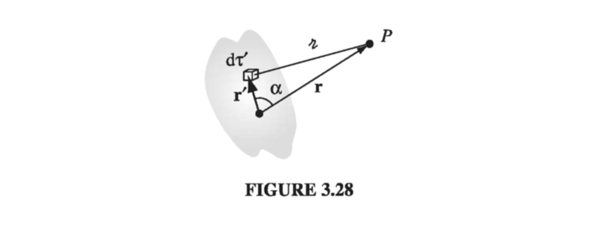
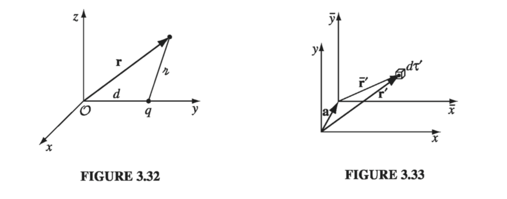
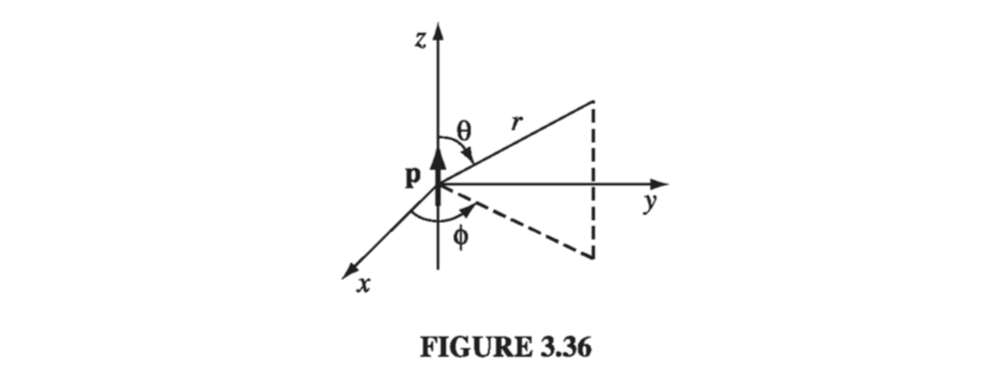
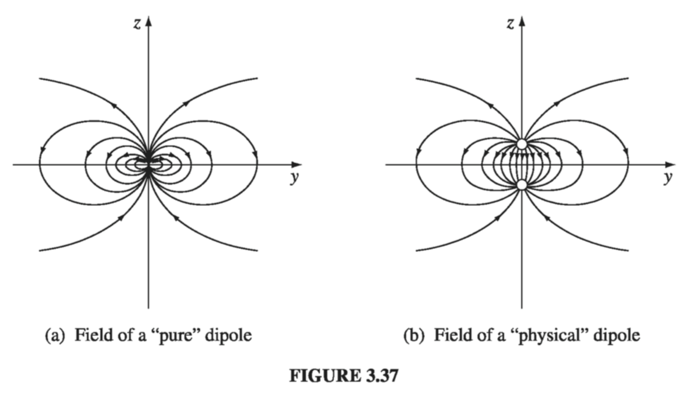

# 3.4: Multipole Expansion

## 3.4.1: Approximate Potentials at Large Distances

If you are very far away from a localized charge distribution, it "looks" like a point charge, and the potential is - to good approximation - $ (1/4 \pi \epsilon_0) Q/r $, where $ Q $ is the total charge. We have often used this as a check on formulas for _V_. But what if $ Q $ is zero? You might reply that the potential is then approximately zero, and of course, you're right in a sense (indeed, the potential at large _r_ is pretty small even if _Q_ is not zero). But we're looking for something a bit more informative than that.

#### Example 3.10

````{tab-set}
```{tab-item} "Q"

A (physical) __electric dipole__ consists of two equal and opposite charges $ (\pm q) $ separated by a distance _d_. Find the approximate potential at points far from the dipole

```
```{tab-item} "A"

Let $ \Delta r _- $ be the distance from $ -q $ and $ \Delta r _{+} $ be the distance from $ +q $ (Fig. 3.26). 

Then

$$
V(r) = \frac{1}{4 \pi \epsilon_0} \left( \frac{q}{\Delta r _{+}} - \frac{q}{\Delta r _{-}} \right)
$$

and (from the law of cosines),

$$
\Delta r _{\pm} ^2 = r^2 + (d/2)^2 \mp r d \cos \theta = r^2 \left( 1 \mp \frac{d}{r} \cos \theta + \frac{d^2}{4r^2}  \right)
$$

We're interested in the regime $ r \gg d $, so the third term is negligible, and the binomial expansion yields

$$
\frac{1}{\Delta r _{\pm}} \approx \frac{1}{r} \left( 1 \mp \frac{d}{r} \cos \theta \right) ^{-1/2} \approx \frac{1}{r} \left( 1 \pm \frac{d}{2r} \cos \theta \right) 
$$

Thus

$$
\frac{1}{\Delta r _+} - \frac{1}{\Delta r _{-}} \approx \frac{d}{r^2} \cos \theta  
$$

and hence

$$
V(r) \approx \frac{1}{4 \pi \epsilon_0} \frac{qd \cos \theta}{r^2} \tag{3.90} 
$$

The potential of a dipole goes like $ 1/r^2 $ at large _r_; as we might have anticipated, it falls off more rapidly than the potential of a point charge. If we put together a pair of equal and opposite dipoles to make a __quadrupole__, the potential goes like $ 1/r^3 $; for back-to-back quadrupoles (an __octopole__), it goes like $ 1/r^4 $, and so on. Figure 3.27 summarizes the hierarchy; for completeness I have included the electric __monopole__ (point charge), whose potential, of course, goes like $ 1/r $


```
````

Example 3.10 pertains to a very special charge configuration. I propose now to develop a systematic expansion for the potential of _any_ localized charge distribution, in powers of $ 1/r $. Figure 3.28 defines the relevant variables; the potential at __r__ is given by

$$
V(r) = \frac{1}{4 \pi \epsilon_0} \int \frac{1}{\Delta r } \rho(\vec{r'}) \mathrm{d}{\tau'} \tag{3.91}
$$


Using the law of cosines,

$$
\Delta r  ^2 = r^2 + (r')^2 - 2r r' \cos \alpha = r^2 \left[ 1 + \left( \frac{r'}{r}  \right)^2 - 2 \left( \frac{r'}{r}  \right)\cos \alpha \right]
$$

where $ \alpha $ is the angle between $ \vec{r} $ and $ \vec{r'} $. Thus,

$$
 \Delta r  = r \sqrt{1 + \epsilon} \tag{3.92}
 $$
 
with

$$
\epsilon \equiv \left( \frac{r'}{r} \right)\left( \frac{r'}{r} - 2 \cos \alpha \right)
$$

For points well outside the charge distribution, $ \epsilon $ is much less than 1, and this invites a binomial expansion:

$$
\frac{1}{\Delta r }  = \frac{1}{r} (1 + \epsilon)^{-1/2} = \frac{1}{r} \left( 1 - \frac{1}{2} \epsilon + \frac{3}{8} \epsilon^2 - \frac{5}{16} \epsilon^3 + \ldots \right) \tag{3.93}
$$

or, in terms of $ r, r' $, and $ \alpha $,

$$
\begin{aligned}
\frac{1}{\Delta r } & =  \frac{1}{r} \left[ 1 - \frac{1}{2} \left( \frac{r'}{r}  \right) \left( \frac{r'}{r} - 2 \cos \alpha \right) + \frac{3}{8} \left( \frac{r'}{r}  \right)^2 \left( \frac{r'}{r} - 2 \cos \alpha \right)^2 \right. \\ 
& \qquad \left. - \frac{5}{16} \left( \frac{r'}{r}  \right)^3 \left( \frac{r'}{r} - 2 \cos \alpha \right)^3 + \ldots \right] \\
& = \frac{1}{r} \left[ 1 + \left( \frac{r'}{r} \right)(\cos \alpha) + \left( \frac{r'}{r} \right) \left( \frac{3 \cos ^2 \alpha - 1}{2}  \right) \right. \\
& \qquad \left. \left( \frac{r'}{r} \right)^3 \left( \frac{5\cos ^3 \alpha - 3 \cos \alpha}{2}  \right) + \ldots \right]
\end{aligned}
$$

In the last step, I have collected together like powers of $ (r'/r) $; surprisingly, their coefficients (the terms in parentheses) are Legendre polynomials! The remarkable result is that

$$
\frac{1}{\Delta r } = \frac{1}{r} \sum_{n=0}^\infty \left( \frac{r'}{r}  \right)^n P_n (\cos \alpha) \tag{3.94}
$$

Substituting this back into $ \eqref{3.91} $, and noting that $ r $ is constant, as far as the integration is concerned, I conclude that

$$
V(\vec{r}) = \frac{1}{4 \pi \epsilon_0} \sum_{n=0} ^\infty \frac{1}{r^{(n+1)}} \int (r') P_n(\cos \alpha) \rho(\vec{r'}) \mathrm{d}{\tau'} \tag{3.95} 
$$

or, more explicitly,

$$
V(\vec{r}) = \frac{1}{4 \pi \epsilon_0} \left[ \frac{1}{r} \int \rho(\vec{r'}) \mathrm{d}{\tau'} + \frac{1}{r^2} \int r' \cos \alpha \rho(\vec{r'})\mathrm{d}{\tau'} \right. \\
 + \left. \frac{1}{r^3} \int (r')^2 \left( \frac{3}{2} \cos^2 \alpha - \frac{1}{2}  \right) \rho(\vec{r'}) \mathrm{d}{\tau'} + \ldots \right] \tag{3.96}
$$

This is the desired result - the __multipole expansion__ of $ V $ in powers of $ 1/r $. The first term $ (n=0) $ is the monopole contribution (it goes like $ 1/r $); the second $ (n=1) $ is the dipole (it goes like $ 1/r^2 $ ); the third is quadrupole; the fourth octopole, and so on. Remember that $ \alpha $ is the angle between $ \vec{r} $ and $ \vec{r'} $, so the integrals depend on the direction to the field point. If you are interested in the potential along the $ z' $ axis (or - putting it the other way round - if you orient your $ \vec{r'} $ coordinates so the $ z' $ axis lies along $ \vec{r} $), then $ \alpha $ is the usual polar angle $ \theta' $.
As it stands, $ \eqref{3.95} $ is _exact_, but it is useful primarily as an approximation scheme: the lowest nonzero term in the expansion provides the approximate potential at large _r_, and the successive terms tell us how to improve the approximation if greater precision is required.

## 3.4.2: The Monopole and Dipole Terms

Ordinarily, the multipole expansion is dominated (at large r) by the monopole term:

$$
V_{mon} (\vec{r}) = \frac{1}{4 \pi \epsilon_0} \frac{Q}{r} 
$$

where $ Q =\int \rho \mathrm{d}{\tau} $ is the total charge of the configuration. This is just what we expect for the approximate potential at large distances from the charge. For a point charge at the origin, $ V_{mon} $ is the exact potential, not merely a first approximation at large r; in this case, all the higher multipoles vanish.
If the total charge is zero, the dominant term in the potential will be the dipole (unless, of course, it also vanishes):

$$
V_{dip}(\vec{r}) = \frac{1}{4 \pi \epsilon_0} \frac{1}{r^2} \int r' \cos \alpha \rho(\vec{r'}) \mathrm{d}{\tau'} 
$$

Since $ \alpha $ is the angle between $ r' $ and $ r $ (Fig 2.38),

$$
r' \cos \alpha = \hat{r} \cdot \vec{r'}
$$

and the dipole potential can be written more succinctly:

$$
V_{dip}(\vec{r}) = \frac{1}{4 \pi \epsilon_0} \frac{1}{r^2} \hat{r} \cdot \int \vec{r'} \rho(\vec{r'}) \mathrm{d}{\tau'}
$$

This integral (which does not depend on $ \vec{r} $ ) is called the __dipole moment__ of the distribution:

$$
\vec{p} \equiv \int \vec{r'} \rho(\vec{r'}) \mathrm{d}{\tau'} \tag{3.98}
$$

and the dipole contribution to the potential simplifies to

$$
V_{dip}(\vec{r}) = \frac{1}{4 \pi \epsilon_0} \frac{\vec{p} \cdot \hat{r}}{r^2} \tag{3.99} 
$$

The dipole moment is determined by the geometry (size, shape, and density) of the charge distribution. $ \eqref{3.98} $ translates in the usual way (Sect 2.1.4) for point, line, and surface charges. Thus, the dipole moment for a collection of point charges is

$$
\vec{p} = \sum_{i=1} ^n q_i \vec{r'}_i \tag{3.100}
$$

For a __physical dipole__ (equal and opposite charges $ \pm q $),

$$
\vec{p} = q\vec{r'_+} - q \vec{r_- ' } = q(\vec{r' _+} - \vec{r'_-}) = q \vec{d} \tag{3.101}
$$

where $ \vec{d} $ is the vector from the negative charge to the positive one (Fig. 3.29).


Is this consistent with what we got in Example 3.10? Yes: If you put $ \eqref{3.101} $ into $ \eqref{3.99} $, you recover $ \eqref{3.90} $. Notice, however, that this is only the _approximate_ potential of the physical dipole - evidently there are higher multipole contributions. Of course, as you go farther and farther away, $ V_{dip} $ becomes a better and better approximation, since the higher terms die off more rapidly with increasing $ r $. By the same token, at a fixed $ r $ the dipole approximation improves as you shrink the separation distance $ d $. To construct a __perfect dipole__ whose potential is given exactly by $ \eqref{3.99} $, you'd have to let $ d $ approach zero. Unfortunately you then lose the dipole term too, unless you simultaneously arrange for q to go to infinity! A _physical_ dipole becomes a _pure_ dipole, then, in the rather artificial limit $ d \rightarrow 0. q \rightarrow \infty $, with the product $ qd = p $ held fixed. When someone uses the word "dipole," you can't always tell whether they mean a _physical_ dipole (with finite separation between the charges) or an _ideal_ dipole. If in doubt, assume that _d_ is small enough that you can safely apply $ \eqref{3.99} $.

Dipole moments are _vectors_, and they add accordingly: if you have two dipoles $ \vec{p_1} $ and $ \vec{p_2} $, the total dipole moment is $ \vec{p_1} + \vec{p_2} $. For instance, with four charges at the corners of a square, as shown in Fig. 3.30, the net dipole moment is zero. You can see this by combining the charges in pairs or by adding up the four contributions individually using $ \eqref{3.100} $. This is a _quadrupole_, as I indicated earlier, and its potential is dominated by the quadrupole term in the multipole expansion.


## 3.4.3: Origin of Coordinates in Multipole Expansions

I mentioned earlier that a point charge at the origin constitutes a "pure" monopole. If it is not at the origin, it's no longer a pure monopole. For instance, the charge in Fig. 3.32 has a dipole moment $ \vec{p} = q d \hat{y} $, and a corresponding dipole term in its potential. The monopole potential $ (1/4 \pi \epsilon_0) q/r $  is not quite correct for this configuration; rather, the exact potential is $ (1/4 \pi \epsilon_0) q/\Delta r  $. The multipole expansion is, remember, a series in inverse powers of r (the distance to the origin), and when we expand $ 1/\Delta r  $, we get all powers, not just the first.

So moving the origin (or, what amounts to the same thing, moving the charge) can radically alter a multipole expansion. The __monopole moment__ $ Q $  does not change, since the total charge is obviously independent of the coordinate system. (In Fig. 3.32, the monopole term was unaffected when we moved q away from the origin - it's just that it was no longer the whole story: a dipole term - and for that matter all higher poles - appeared as well.) Ordinarily, the dipole moment does change when you shift the origin, but there is an important exception: If the total charge is zero, then the dipole moment is independent of the choice of origin. For suppose we displace the origin by an amount $ \vec{a} $  (Fig. 3.33). The new dipole moment is then

$$
\begin{aligned}
\vec{p_2} & = \int \vec{r'} \rho(\vec{r'}) \mathrm{d}{\tau'} = \int (\vec{r'} - \vec{a} ) \rho (\vec{r'}) \mathrm{d}{\tau'} \\
& = \int \vec{r'} \rho(\vec{r'}) \mathrm{d}{\tau'} - \vec{a} \int \rho(\vec{r'}) \mathrm{d}{\tau'} = \vec{p} - Q \vec{a}
\end{aligned}
$$



In particular, if $ Q = 0 $, the $ \vec{p_2} = \vec{p} $. So if someone asks for the dipole moment in Fig 3.34(a), you can answer with confidence "$ q \vec{d} $," but if you're asked for the dipole moment in Fig 3.34(b), the appropriate response would be "With respect to what origin?"


## 3.4.4: The Electric Field of a Dipole

So far we have only worked with _potentials_. Now I would like to calculate the electric field of a (perfect) dipole. If we choose coordinates so that $ \vec{p} $ is at the origin and points in the z direction (Fig. 3.36), then the potential at $ r, \theta $ is $ \eqref{3.99} $:

$$
V_{dip} (r, \theta) = \frac{\hat{r} \cdot \vec{p}}{4 \pi \epsilon_0 r^2} = \frac{p \cos \theta}{4 \pi \epsilon_0 r^2} \tag{3.102} 
$$
 



To get the field, we take the negative gradient of $ V $:

$$
\begin{aligned}
E_r & = - \frac{\partial V}{\partial r} = \frac{2 p \cos \theta}{4 \pi \epsilon_0 r^3} \\
E_\theta & = - \frac{1}{r} \frac{\partial V}{\partial \theta} = \frac{p \sin \theta}{4 \pi \epsilon_0 r^3} \\
E_\phi & = - \frac{1}{r \sin \theta} \frac{\partial V}{\partial \phi} = 0 
\end{aligned}
$$

Thus,

$$
\vec{E_{dip}} (r, \theta) = \frac{p}{4 \pi \epsilon_0 r^3}(2 \cos \theta \hat{r} + \sin \theta \hat{\theta}) \tag{3.103} 
$$

This formula makes explicit reference to a particular coordinate system (spherical) and assumes a particular orientation for $ \vec{p} $ (along z). It can be recast in a coordinate-free form, analogous to the potential in $ \eqref{3.99} $  - See problem 3.36.

Notice that the dipole falls off as the inverse cube of r; the monopole field $ (Q / 4 \pi \epsilon_0 r^2) \hat{r} $ goes as the inverse square, of course. Quadrupole fields go like $ 1/r^4 $, octopole like $ 1/r^5 $, and so on. (This merely reflects how the respective potentials fall off - the gradient introduces another factor of $ 1/r $ ).

Figure 3.37(a) shows the field lines of a "pure" dipole $ \eqref{3.103} $. For comparison, I have also sketched the field lines for a "physical" dipole, in Fig 3.37(b). Notice how similar the two pictures become if you blot out the central region; up close, however, they are entirely different. Only for points $ r \gg d $ does $ \eqref{3.103} $ represent a valid approximation to the field of a physical dipole. As I mentioned earlier, this regime can be reached either by going to large $ r $ or by squeezing the charges very close together.

