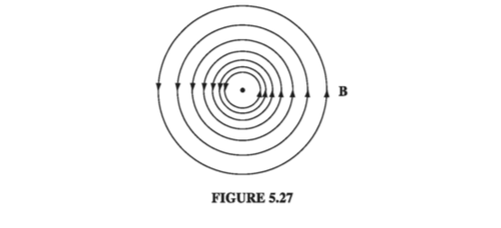

# 5.3: The Divergence and Curl of B

## 5.3.1: Straight-Line Currents

The magnetic field of an infinite straight wire is shown in Fig 5.27 (the current is coming out of the page). At a glance, it is clear that this field has a nonzero curl (something you'll never see in an electrostatic field); let's calculate it.

According to Eq. 5.38, the integral of __B__ around a circular path of radius _s_, centered at the wire, is

$$
\oint \vec{B} \cdot \mathrm{d} l = \oint \frac{\mu_0 I}{2 \pi s}  = \frac{\mu_0 I}{2 \pi s } \oint \mathrm{d} l = \mu_0 I
$$

Notice that the answer is independent of _s_; that's because _B_ decreases at the same rate as the circumference increases. In fact, it doesn't have to be a circle; any old loop that encloses the wire would give the same answer. For if we use cylindrical coordinates $ (s, \phi, z) $, with the current flowing along the z axis, $ \vec{B} = (\mu_0 I / 2 \pi s) \hat{\phi} $ and $ \mathrm{d} \vec{l} = \mathrm{d} s \, \hat{s} + s \mathrm{d} \phi \, \hat{\phi} + \mathrm{d} z \, \hat{z} $, so

$$
\oint \vec{B} \cdot \mathrm{d}  l = \frac{\mu_0 I}{2 \pi} \oint \frac{1}{s} s \mathrm{d} \phi = \frac{\mu_0 I}{2 \pi } \int _0 ^{2 \pi}  \mathrm{d} \phi = \mu_0 I
$$

This assumes that the loop encircles the wire exactly once; if it went around twice, then $ \phi $ would go from $ 0 $ to $ 4 \pi $, and if it didn't enclose the wire at all, then $ \phi $ would go from $ \phi_1  $ to $ \phi_2 $ and back again, with $ \int \mathrm{d} \phi = 0 $  (Fig 5.28).

Now suppose we have a bundle of straight wires. Each wire that passes through our loop contributes $ \mu_0 I $, and those outside contribute nothing (Fig 5.29). The line integral will then be

$$
\oint \vec{B} \cdot \mathrm{d} l = \mu_0 I_{enc} 
$$ (eq5.44)

where $ I_{enc} $ stands for the total current enclosed by the integration path. If the flow of charge is represented by a volume current density __J__, the enclosed current is  

$$
I_{enc} = \int \vec{J} \cdot \mathrm{d} \vec{a} 
$$ (eq5.45)

with the integral taken over any surface bounded by the loop. Applying Stokes' theorem to Eq 5.44, then

$$
\int (\nabla \times  \vec{B}) \cdot \mathrm{d} \vec{a} = \mu_0 \int \vec{J} \cdot \mathrm{d} \vec{a}
$$

and hence

$$
\nabla \times  \vec{B} = \mu_0 \vec{J}
$$

With minimal labor, we have actually obtained the general formula for the curl of __B__. But our derivation is seriously flawed by the restriction to infinite straight line currents (and combinations thereof). Most current configurations cannot be constructed out of infinite straight wires, and we have no right to assume that Eq. 5.46 applies to them. So the next section is devoted to the formal derivation of the divergence and curl of B, starting from the Biot-Savart law itself.

## 5.3.2: The Divergence and Curl of B

The Biot-Savart law for the general case of a volume current reads

$$
\vec{B}(\vec{r}) = \frac{\mu_0}{4 \pi} \int \frac{\vec{J}(r') \times \hat{\Delta r }}{\Delta r  ^2} \mathrm{d} \tau
$$ (eq5.47)

This formula gives the magnetic field at a point r = (x, y, z) in terms of an integral over the current distribution $ \vec{J} (x', y', z') $ (Fig 5.30). It is best to be absolutely explicit at this stage:

- __B__ is a function of (x, y, z)
- __J__ is a function of (x', y', z')
- $ \hat{\Delta r } = (x - x') \hat{x} + (y - y') \hat{y} + (z - z') \hat{z} $ 
- $ \mathrm{d} \tau' = dx' dy' dz' $ 

The integration is over the primed coordinates; the divergence and the curl of __B__ are with respect to the unprimed coordinates.

Applying the divergence to {eq}`eq5.47` we obtain

$$
\nabla \cdot  \vec{B} = \frac{\mu_0 }{4 \pi } \int \nabla \cdot  \left( \vec{J} \times \frac{\hat{\Delta r }}{\Delta r ^2} \right)\mathrm{d} \tau' 
$$ (eq5.48)

With one of our product rules for divergences

$$
\nabla \cdot  \left( \vec{J} \times \frac{\hat{\Delta r }}{\Delta r ^2} \right) = \frac{\hat{\Delta r }}{\Delta r ^2} \cdot (\nabla \times  \vec{J}) - \vec{J} \cdot \left( \nabla \times  \frac{ \hat{\Delta r }}{\Delta r  ^2} \right) 
$$ (eq5.49)

But $ \nabla \times  \vec{J} = 0 $ because __J__ doesn't depend on the unprimed variables, while $ \nabla \times  ( \hat{\Delta r } / \Delta r  ^2) = 0 $ (we've already explicitly worked that in Chapter 1), so

$$
\nabla \cdot  \vec{B} = 0 
$$ (eq5.50)

Evidently, the _divergence_ of the magnetic field is zero.

Applying the curl to Eq 5.47, we obtain

$$
\nabla \times  \vec{B} = \frac{\mu_0}{4 \pi} \int \nabla \times  \left( \vec{J} \times \frac{\hat{\Delta r }}{\Delta r  ^2} \right) \mathrm{d} \tau' 
$$ (eq5.51)

Again, our strategy is to expand the integrand, using the appropriate product rule - in this case one of those for curls

$$
\nabla \times  \left( \vec{J} \times \frac{\hat{\Delta r }}{\Delta r ^2} \right) = \vec{J} \left( \nabla \cdot  \frac{\hat{\Delta r }}{\Delta r  ^2} \right) - ( \vec{J} \cdot \nabla ) \frac{\hat{\Delta r }}{\Delta r ^2}
$$ (eq5.52)

(I have dropped terms involving derivatives of __J__, because __J__ does not depend on x, y, z.) The second term integrates to zero, as we'll see in the next paragraph. The first term involves the divergence we were at pains to calculate in Chapter 1 (Eq. 1.100):

$$
\nabla \cdot  \left( \frac{\hat{\Delta r }}{\Delta r ^2} \right) = 4 \pi \delta ^2(\Delta r ) 
$$ (eq5.53)

Thus

$$
\nabla \times  \vec{B} = \frac{\mu_0}{4 \pi} \int \vec{J}(r') 4 \pi \delta ^3 (\vec{r} - \vec{r'} \mathrm{d} \tau' = \mu_0 \vec{J} (\vec{r})
$$

which confirms that Eq. 5.46 is not restricted to straight-line currents, but holds quite generally in magnetostatics.

To complete the argument, however, we must check that the second term in Eq 5.52 integrates to zero. Because the derivative acts only on $ \hat{\Delta r } / \Delta r  ^2 $, we can switch from $ \nabla  $ to $ \nabla ' $ at the cost of a minus sign

$$
-(\vec{J} \cdot \nabla ) \frac{\hat{\Delta r }}{\Delta r ^2} = (\vec{J} \cdot \nabla ' ) \frac{\hat{\Delta r }}{\Delta r ^2}  
$$ (eq5.54)

The x component, in particular, is

$$
(\vec{J} \cdot \nabla ') \left( \frac{x - x' }{\Delta r  ^3}  \right) = \nabla ' \cdot \left( \frac{(x - x')}{\Delta r  ^3} \vec{J} \right) - \left( x - x' \Delta r  ^3  \right)(\nabla ' \cdot \vec{J})
$$

Now, for steady currents the divergence of __J__ is zero, so

$$
\left( - (\vec{J} \cdot \nabla ) \frac{\hat{\Delta r }}{\Delta r ^2} \right)_{x} = \nabla ' \cdot \left( \frac{(x - x')}{\Delta r  ^3} \vec{J} \right)
$$

and therefore this contribution to the integral can be written

$$
\int_{V} \nabla ' \cdot \left( \frac{(x - x')}{\Delta r  ^3} \vec{J} \right) \mathrm{d} \tau' = \oint_S \frac{(x - x')}{\Delta r ^3} \vec{J} \cdot \mathrm{d} \vec{a'} 
$$ (eq5.55)

(The reason for switching from $ \nabla  $ to $ \nabla ' $ was to allow this integration by parts).

But what region are we integrating over? Well, it's the volume that appears in the Biot-Savart law (Eq. 5.47) - large enough, that is, to include all the current. You can make it bigger than that, if you like; $ \vec{J} = 0 $ out there anyway, so it will add nothing to the integral. The essential point is that on the boundary the current is zero (all current is safely inside) and hence the surface integral (Eq. 5.55) vanishes.

## 5.3.3: Ampere's Law

The equation for the curl of __B__,

$$
\nabla \times  \vec{B} = \mu_0 \vec{J} 
$$ (eq5.56)

is called _Ampere's Law_ (in differential form). It can be converted to integral form by the usual device of applying one of the fundamental theorems - in this case Stokes' theorem:

$$
\int (\nabla \times  \vec{B}) \cdot \mathrm{d} \vec{a} = \oint \vec{B} \cdot \mathrm{d} \vec{l} = \mu_0 \int \vec{J} \cdot \mathrm{d} \vec{a}
$$

Now, $ \int \vec{J} \cdot \mathrm{d} \vec{a} $ is the total current passing through the surface (Fig. 5.31), which we call $ I_{enc} $ (the current enclosed by the Amperian loop). Thus

$$
\oint \vec{B} \cdot \mathrm{d} \vec{l} = \mu_0 I_{enc} 
$$ (eq5.57)

This is the integral version of Ampere's law; it generalizes Eq 5.44 to arbitrary steady currents. Notice that Eq 5.57 inherits the sign ambiguity of Stokes' theorem: which _way_ around the loop am I supposed to go? And which direction through the surface corresponds to a "positive" current? The resolution, as always, is the right-hand rule: If the fingers of your right hand indicate the direction of integration around the boundary, then your thumb defines the direction of a positive current.

Just as the Biot-Savart law plays a role in magnetostatics that Coulomb's law assumed in electrostatics, so Ampere's plays the part of Gauss's. In particular, for currents with appropriate symmetry, Ampere's law in integral form offers a lovely and extraordinarily efficient way of calculating the magnetic field.

### Example 5.7

::::{tab-set}
:::{tab-item} Q

Find the magnetic field a distance s from a long straight wire (Fig 5.32), carrying a steady current I (the same problem from the previous section, in which we used the Biot-Savart law)

:::
:::{tab-item} A

We know the direction of __B__ is "circumferential," circling around the wire as indicated by the right-hand rule. By symmetry, the magnitude of __B__ is constant around an Amperian loop of radius _s_, centered on the wire. So Ampere's law gives

$$
\oint \vec{B} \cdot \mathrm{d} \vec{l} = B \oint dl = 2 \pi s B = \mu_0 I_{enc} = \mu_0 I
$$

or

$$
B = \frac{\mu_0 I}{2 \pi s} 
$$

This is the same answer we got before (Eq. 5.38), but it was way easier to obtain this time.

:::
::::

### Example 5.8

::::{tab-set}
:::{tab-item} Q

Find the magnetic field of an infinite uniform surface current $ \vec{K} = K \hat{x} $, flowing over the xy plane (Fig 5.33)

:::
:::{tab-item} A

First of all, what is the direction of B? Could it have any x component? No: A glance at the Biot-Savart law (Eq. 5.42) reveals that B is perpendicular to K. Could it have a z component? No again. You could confirm this by noting that any vertical contribution from a filament at +y is canceled by the corresponding filament at - y. But there is a nicer argument: Suppose the field pointed away from the plane. By reversing the direction of the current, I could make it point toward the plane (in the Biot-Savart law, changing the sign of the current switches the sign of the field). But the z component of B cannot possibly depend on the direction of the current in the xy plane. (Think about it!) So B can only have a y component, and a quick check with your right hand should convince you that it points to the left above the plane and to the right below it.

With this in mind, we draw a rectangular Amperian loop as shown in Fig. 5.33, parallel to the yz plane and extending an equal distance above and below the surface. Applying Ampere's law,

$$
\oint \vec{B} \cdot \mathrm{d} \vec{l} = 2 B l = \mu_0 I_{enc} = \mu_0 K l
$$

(One Bl comes from the top segment and the other from the bottom), so $ B = (\mu_0 / 2) K $, or, more precisely

$$
\vec{B} = \begin{cases}
+(\mu_0 / 2) K \hat{y} \quad & \text{ for } z < 0 \\
- (\mu_0 / 2) K \hat{y} \quad & \text{ for } z > 0
\end{cases} 
$$ (eq5.58)

Notice that the field is independent of the distance from the plane, just like the electric field of a uniform surface charge.

:::
::::

### Example 5.9

::::{tab-set}
:::{tab-item} Q

Find the magnetic field of a very long solenoid, consisting of n closely wound turns per unit length on a cylinder of radius R, each carrying a steady current I (Fig 5.34). [The point of making the windings so close is that one can then pretend each turn is circular. If this troubles you (after all, there is a net current I in the direction of the solenoid's axis, no matter how tight the winding), picture instead a sheet of aluminum foil wrapped around the cylinder, carrying the equivalent of a uniform surface current K = nI (Fig 5.35). Or make a double winding, going up to one end and then - always in the same sense - going back down again, thereby eliminating the net longitudinal current. But, in truth, this is all unnecessary fastidiousness, for the field inside a solenoid is huge (relatively speaking), and the field of the longitudinal current is at most a tiny refinement.

:::
:::{tab-item} A

First of all, what is the direction of __B__? Could it have a radial component? No. For suppose $ B_s $ were positive; if we reversed the direction of the current, $ B_s $ would then be negative. But switching I is physically equivalent to turning the solenoid upside down, and that certainly should not alter the radial field. How about a "circumferential" component? No. For $ B_{\phi} $  would be constant around an Amperian loop concentric with the solenoid (Fig. 5.36), and hence

$$
\oint \vec{B} \cdot \mathrm{d} \vec{l} = B_{\phi} (2 \pi s) = \mu_0 I_{enc} = 0
$$

since the loop encloses no current.

So, the magnetic field of an infinite, closely wound solenoid runs parallel to the axis. From the right-hand rule, we expect that it points inside the solenoid and downward outside. Moreover, it certainly approaches zero as you go very far away. With this in mind, let's apply Ampere's law to the two rectangular loops in Fig 5.37. Loop 1 lies entirely outside the solenoid, with its sides at distances a and b from the axis:

$$
\oint \vec{B} \cdot \mathrm{d} \vec{l} = [ B(a) - B(b)] L = \mu_0 I_{enc} = 0
$$

so

$$
B(a) = B(b)
$$

Evidently the field outside does not depend on the distance from the axis. But we agreed that it goes to zero for large s. It must therefore be zero everywhere! (This astonishing result can also be derived from the Biot-Savart law, of course, but it's much more difficult. See Prob. 5.46.)

As for loop 2, which is half inside and half outside, Ampere's law gives

$$
\oint \vec{B} \cdot \mathrm{d} \vec{l} = B L = \mu_0 I_{enc} = \mu_0 n I L
$$

where B is the field inside the solenoid. (The right side of the loop contributes nothing, since B = 0 out there.) Conclusion:

$$
\vec{B} = 
\begin{cases}
\mu_0 n I \hat{z} & \quad \text{ inside the solenoid } \\
0 & \quad \text{ outside the solenoid }
\end{cases}

$$ (eq5.59)

Notice that the field inside is uniform - it doesn't depend on the distance from the axis. In this sense the solenoid is to magnetostatics what the parallel-plate capacitor is to electrostatics: a simple device for producing strong uniform fields.

:::
::::

Like Gauss's law, Ampere's law is always true (for steady currents), but it is not always useful. Only when the symmetry of the problem enables you to pull __B__ outside the integral $ \oint \vec{B} \cdot \mathrm{d} \vec{l} $  can you calculate the magnetic field from Ampere's law. When it does work, it's by far the fastest method; when it doesn't, you have to fall back on the Biot-Savart law. The current configurations that can be handled by Ampere's law are

1. Infinite straight lines (Ex 5.7)
2. Infinite planes (Ex 5.8)
3. Infinite solenoids (Ex 5.9)
4. Toroids (Ex 5.10)

The last of these is a surprising and elegant application of Ampere's law. As in Exs. 5.8 and 5.9, the hard part is figuring out the direction of the field (which we will now have done, once and for all, for each of the four geometries); the actual application of Ampere's law takes only one line.

### Example 5.10

::::{tab-set}
:::{tab-item} Q

A toroidal coil consists of a circular ring, or 'donut,' around which a long wire is wrapped (Fig 5.38). The winding is uniform and tight enough so that each turn can be considered a plane closed loop. The cross-sectional shape of the coil is immaterial; I made it rectangular in Fig 5.38 for the sake of simplicity, but it could just as well be circular or even some weird asymmetrical form, as in Fig 5.39, as long as the shape remains the same all the way around the ring. In that case, it follows that the magnetic field of the toroid is circumferential at all points, both inside and outside the coil.

:::
:::{tab-item} A

According to the Biot-Savart law, the field at __r__ due to the current element at __r'__ is

$$
\mathrm{d} \vec{B} = \frac{\mu_0 }{4 \pi} \frac{\vec{I} \times \hat{\Delta r }}{\Delta r  ^3} \mathrm{d} l'
$$

We may as well put __r__ in the xz plane (Fig 5.39), so its Cartesian components are (x, 0, z), while the source coordinates are

$$
\vec{r'} = (s' \cos \phi', s' \sin \phi', z')
$$

Then

$$
\Delta r  = (x - s' \cos \phi', -s' \sin \phi', z - z')
$$

Since the current has no $ \phi $  component, $ \vec{I} = I_s \hat{x} + I_z \hat{z} $, or (in Cartesian coordinates)

$$
\vec{I} = (I_s \cos \phi', I_s \sin ' , I_z)
$$

Accordingly,

$$
\vec{I} \times \vec{\Delta r } = \begin{bmatrix}
\hat{x} & \hat{y} & \hat{z} \\
I_s \cos \phi' & I_s \sin \phi' & I_z \\
(x - s' \cos \phi') & (- s' \sin \phi') & (z - z')
\end{bmatrix} \\
= [ \sin \phi' (I_s (z - z') + s' I_z)] \hat{x} + [I_z (x - s' \cos \phi') - I_s \cos \phi' (z - z')] \hat{y} + [-I_s x \sin \phi']\hat{z}
$$

But there is a symmetrically situated current element at __r''__, with the same $ s' $ , the same $ \Delta r  $, the same $ dl' $, the same $ I_s $, and the same $ I_z $, but _negative_ $ \phi' $ (Fig 5.39). Because $ \sin \phi' $ changes sign, the $ \hat{x} $ and $ \hat{z} $ contributions from $ \hat{r'} $ and $ \hat{r''} $ cancel each other, leaving only a $ \hat{y} $ term. Thus the field at $ \hat{r} $ is in the $ \hat{y} $ direction, and in general the field points in the $ \hat{\phi} $ direction. 

Now that we know the field is circumferential, determining its magnitude is simple: just apply Ampere's law to a circle of radius s about the axis of the toroid

$$
B 2 \pi s = \mu_0 I_{enc}
$$

and hence

$$
\vec{B}(\vec{r}) = \begin{cases}
\frac{\mu_0 N I}{2 \pi s} \hat{\phi} \quad & \text{ for points inside the coil} \\
0 \quad & \text{ for points outside the coil}
\end{cases} 
$$ (eq5.60)

where N is the total number of turns.

:::
::::

## 5.3.4: Comparison of Magnetostatics and Electrostatics

The divergence and curl of the electrostatic field are

$$
\begin{cases}
\nabla \cdot  \vec{E} = \frac{1}{\epsilon_0} \rho \quad & \text{(Gauss's law)}\\
\nabla \times  \vec{E} = 0 \quad & \text{(no name)}
\end{cases}
$$

These are __Maxwell's equations__ for electrostatics. Together with the boundary condition $ \vec{E} \rightarrow 0 $ far from all charges, Maxwell's equations determine the field, if the source charge density $ \rho $ is given; they contain essentially the same information as Coulomb's law plus the principle of superposition. The divergence and curl of the magnetostatic field are

$$
\begin{cases}
\nabla \cdot  \vec{B} = 0 \quad & \text{(no name)} \\
\nabla \times  \vec{B} = \mu_0 \vec{J} \quad & \text{(Ampere's Law)}
\end{cases}
$$

These are Maxwell's equations for magnetostatics. Again, together with the boundary condition $ \vec{B} \rightarrow 0 $ far from all currents, Maxwell's equations determine the magnetic field; they are equivalent to the Biot-Savart law (plus superposition). Maxwell's equations and the force law

$$
\vec{F} = Q(\vec{E} + \vec{v} \times \vec{B})
$$

constitute the most elegant formulation of electrostatics and magnetostatics.

The electric field diverges away from a (positive) charge; the magnetic field line curls around a current (Fig. 5.44). Electric field lines originate on positive charges and terminate on negative ones; magnetic field lines do not begin or end anywhere - to do so would require a nonzero divergence. They typically form closed loops or extend out to infinity. To put it another way, there are no point sources for __B__, as there are for __E__; there exists no magnetic analog to electric charge. This is the physical content of the statement $ \nabla \cdot  \vec{B} = 0 $. Coulomb and others believed that magnetism was produced by magnetic charges (magnetic monopoles, as we would now call them), and in some older books you will still find references to a magnetic version of Coulomb's law, giving the force of attraction or repulsion between them. It was Ampere who first speculated that all magnetic effects are attributable to electric charges in motion (currents). As far as we know, Ampere was right; nevertheless, it remains an open experimental question whether magnetic monopoles exist in nature (they are obviously pretty rare, or somebody would have found one), and in fact some recent elementary particle theories require them. For our purposes, though, __B__ is divergenceless, and there are no magnetic monopoles. It takes a moving electric charge to produce a magnetic field, and it takes another moving electric charge to "feel" a magnetic field.

Typically, electric forces are enormously larger than magnetic ones. That's not something intrinsic to the theory; it has to do with the sizes of the fundamental constants $ \epsilon_0 $ and $ \mu_0 $. In general, it is only when both the source charges and the test charge are moving at velocities comparable to the speed of light that the magnetic force approaches the electric force in strength. (Problems 5.13 and 5.17 illustrate this rule.) How is it, then, that we notice magnetic effects at all? The answer is that both in the production of a magnetic field (Biot-Savart) and in its detection (Lorentz), it is the current that matters, and we can compensate for a smallish velocity by pouring huge amounts of charge down the wire. Ordinarily, this charge would simultaneously generate so large an electric force as to swamp the magnetic one. But if we arrange to keep the wire neutral, by embedding in it an equal quantity of opposite charge at rest, the electric field cancels out, leaving the magnetic field to stand alone. It sounds very elaborate, but of course this is precisely what happens in an ordinary current carrying wire.